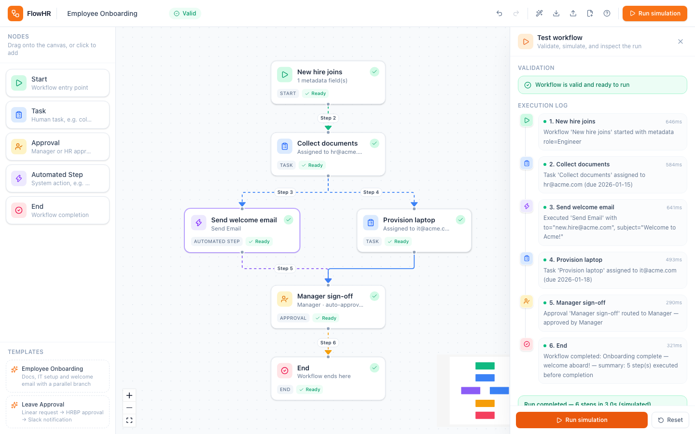
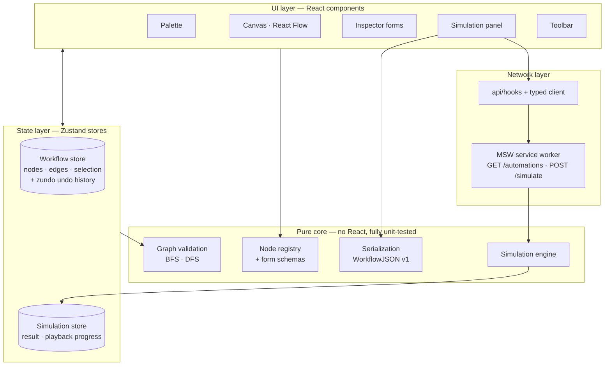
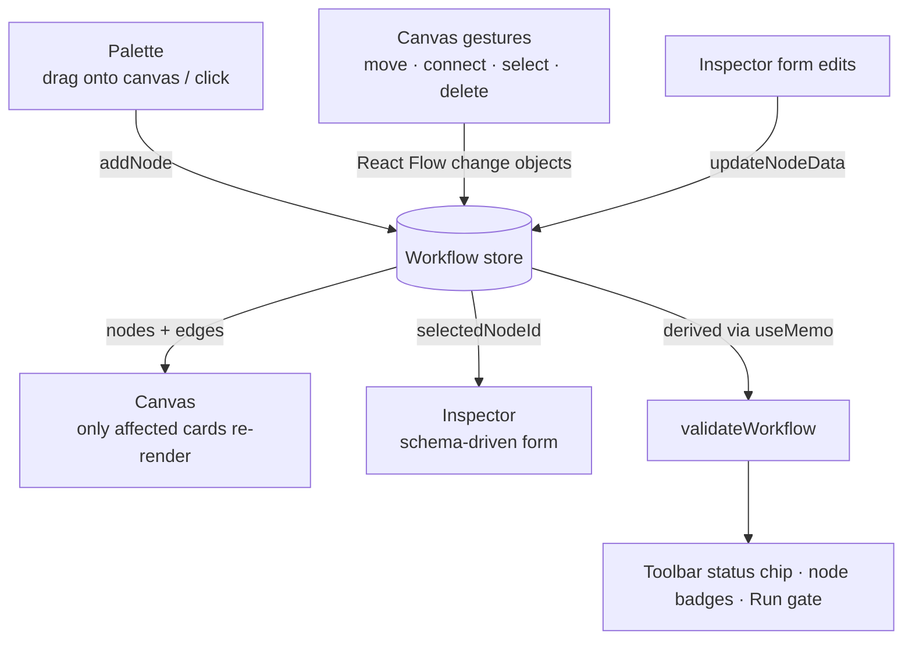
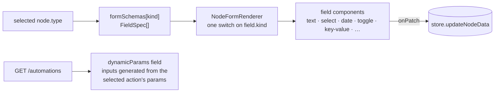
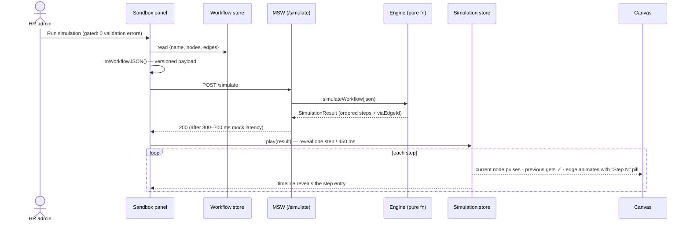

# FlowHR — HR Workflow Designer

A visual workflow designer for HR operations: an HR admin drags process steps onto a canvas,
wires them together, configures each step through dynamic forms, and test-runs the whole
workflow in a simulation sandbox that plays the execution back live on the canvas.

Built for the Tredence Full Stack Engineering Intern case study.

> This README covers the system design and the flows.



## Contents

1. [Quick start](#1-quick-start)
2. [Test drive in 2 minutes](#2-test-drive-in-2-minutes)
3. [System overview](#3-system-overview)
4. [The three core flows](#4-the-three-core-flows)
5. [State design](#5-state-design)
6. [Mock API contract](#6-mock-api-contract)
7. [Validation rules](#7-validation-rules)
8. [Extensibility: adding a node type](#8-extensibility-adding-a-node-type)
9. [Key design decisions](#9-key-design-decisions)
10. [Feature checklist](#10-feature-checklist)
11. [What I'd add with more time](#11-what-id-add-with-more-time)
12. [Assumptions](#12-assumptions)
13. [tricky-bug-note](#13-tricky-bug-note)

## 1. Quick start

Requires Node ≥ 20.

```bash
npm install
npm run dev      # → http://localhost:5173
npm test         # unit tests over the pure core (validation, engine, serialization)
npm run build    # type-check + production build
```

No backend needed — **Mock Service Worker (MSW)** registers a service worker in the browser
and intercepts `GET /automations` and `POST /simulate` at the network layer. It *is* the API.

## 2. Test drive in 2 minutes

**Path A — one click.** Open **Templates** in the left palette → load **Employee Onboarding**
→ press **Run simulation**. Watch the timeline fill step by step while the canvas pulses each
node and stamps traversed edges with "Step N" pills.

**Path B — import the bundled sample.** Toolbar → **Import** →
[`samples/expense-reimbursement.flow.json`](samples/expense-reimbursement.flow.json).
This is a medium-complexity flow exercising every mechanism at once:

```
Start (claim filed)
  └─ Task (submit expense report)
       └─ Approval (Manager, auto-approve ≤ 5000)
            ├─ Automated (Slack → #finance-ops)  ──────────┐   ← parallel branch
            └─ Task (verify receipts)                      │
                 └─ Approval (Director, ≤ 1000)            │
                      └─ Automated (generate voucher) ─────┤
                                                           ▼
                                                    End (payout scheduled)
```

All five node kinds, a branch **and** a merge, key-value metadata, and two configured
automation actions. A unit test imports this exact file, so it can never drift from the code.

**Path C — from scratch.** Drag a Start node, build your own graph, then try to break it:
connect *into* a Start (refused live), add a second Start (blocked with a toast), create a
cycle (named in the validation panel), leave a Task title empty (badge on the node). Errors
gate the Run button; clicking any node-specific issue pans/zooms the canvas to the culprit.

## 3. System overview

The codebase is layered so that **domain logic never imports React**. UI components render
state and dispatch actions; everything that *decides* something lives in `core/` as pure
functions.



Directory map (★ = start reading here):

```
src/
├── core/                # Pure domain logic — zero React imports
│   ├── registry/        # ★ Node type registry + declarative form schemas
│   ├── types/           # Discriminated unions: nodes, steps, issues, payloads
│   ├── validation/      # Connect-time rules + whole-graph validation (BFS/DFS)
│   ├── simulation/      # Mock execution engine (walks the serialized graph)
│   ├── serialization/   # Versioned WorkflowJSON + structural import guards
│   ├── layout/          # dagre auto-layout
│   └── templates/       # Prebuilt demo workflows (reuse the import pipeline)
├── hooks/               # Zustand stores: workflow (+undo), simulation, toasts
├── api/                 # Typed fetch client, react-query-shaped hooks, MSW handlers
├── features/
│   ├── canvas/          # React Flow host + the single generic node card
│   ├── palette/         # Draggable node list + templates menu
│   ├── inspector/       # Schema-driven form renderer + field components
│   ├── simulation/      # Sandbox panel, timeline, playback timer
│   └── io/              # Export / import file handling
└── app/                 # Shell, toolbar, toasts, autosave + keyboard shortcuts
```

| Stack choice | Why |
| --- | --- |
| Vite + React + TypeScript (strict) | fast dev loop; zero `any` in the codebase |
| React Flow v12 (`@xyflow/react`) | canvas, handles, minimap — driven as a controlled component |
| Zustand + `zundo` | granular subscriptions; temporal middleware gives undo/redo for free |
| Tailwind CSS v4 | design tokens per node kind, no stylesheet sprawl |
| MSW | real `fetch`, real latency, real loading states — without a server |
| dagre | one-click auto-layout of the directed graph |
| Vitest | the whole `core/` is testable without a DOM |

## 4. The three core flows

### 4a. The editing loop — one store, one direction

Every mutation, regardless of origin, funnels into the workflow store; every surface renders
from it. There is no second copy of the graph anywhere.



React Flow is run as a **controlled component**: it emits change objects
(`onNodesChange`/`onEdgesChange`), the store applies them. Connection attempts are screened
*during the drag* by pure `canConnect()` rules (no self-loops, no duplicates, nothing into
Start, nothing out of End), so illegal edges can never exist — not even transiently.

### 4b. The form pipeline — schemas, not hand-built forms

Node forms are **data, not JSX**. Each node kind declares a list of field specs; one generic
renderer turns any spec list into a controlled form.



The Automated node is the stress test: picking an action atomically patches
`{actionId, actionLabel, params: {}}`, and the `dynamicParams` field renders one input per
parameter the API declares. Adding a new action to the catalog requires **zero UI changes**.

### 4c. The simulation round trip



The engine walks the graph breadth-first from Start with a visited-set (cycles can't hang
it) and records **which edge led to each node** — that `viaEdgeId` is what the canvas
animates during playback. Playback state lives in a separate store and only *decorates* the
canvas; Reset drops it and the graph is untouched.

## 5. State design

| Store | Owns | In undo history? |
| --- | --- | --- |
| **Workflow** | name, nodes, edges, selection, all graph mutations | ✅ `{name, nodes, edges}` only |
| **Simulation** | panel state, run result, playback progress per node/edge | ❌ |
| **Toasts** | transient notifications | ❌ |

Deliberately separate: undo must never "un-toast" a message or rewind a simulation
highlight. Two refinements worth noting:

- **Undo granularity** — history snapshots are throttled (300 ms), so a drag gesture is one
  undo step instead of fifty pointer-move entries.
- **Render granularity** — every component subscribes with the narrowest selector, so typing
  in the inspector re-renders exactly one node card, not the canvas.

## 6. Mock API contract

**`GET /automations`** — the action catalog for Automated steps:

```json
[
  { "id": "send_email",    "label": "Send Email",        "params": ["to", "subject"] },
  { "id": "generate_doc",  "label": "Generate Document", "params": ["template", "recipient"] },
  { "id": "create_ticket", "label": "Create IT Ticket",  "params": ["system", "priority"] },
  { "id": "slack_notify",  "label": "Notify on Slack",   "params": ["channel", "message"] }
]
```

**`POST /simulate`** — accepts the serialized workflow, returns an execution trace:

```jsonc
// request: WorkflowJSON v1 (same payload used by export/import/templates/autosave)
{ "version": 1, "name": "Expense Reimbursement", "nodes": [...], "edges": [...] }

// response: SimulationResult
{
  "workflowName": "Expense Reimbursement",
  "status": "completed",
  "totalSteps": 8,
  "totalDurationMs": 2140,
  "steps": [
    { "index": 1, "nodeId": "exp-start", "nodeKind": "start", "status": "success",
      "message": "Workflow 'Expense claim filed' started", "durationMs": 180 },
    { "index": 2, "nodeId": "exp-submit", "nodeKind": "task", "viaEdgeId": "exp-e1",
      "status": "success",
      "message": "Task 'Submit expense report' assigned to employee@acme.com (due 2026-09-01)",
      "durationMs": 320 }
    // ...
  ]
}
```

The handler adds 300–700 ms of latency and delegates to the pure engine — the "server" is a
one-line wrapper, so the exact same execution logic runs in unit tests.

## 7. Validation rules

| Rule | Level |
| --- | --- |
| Canvas must not be empty | error |
| Exactly one Start node | error |
| At least one End node | error |
| Start has no incoming / End has no outgoing edges | enforced at connect time |
| No self-connections or duplicate edges | enforced at connect time |
| Every node reachable from Start (BFS) | error |
| No fully disconnected (orphan) nodes | error |
| No cycles — DFS, reported with the node names in the loop | error |
| Per-node data valid (registry `validate`) | error |
| Non-End node with no outgoing edge ("dead end") | warning |

One pure function (`validateWorkflow`) feeds all three consumers: the live toolbar chip, the
sandbox issue list, and the Run gate. Node-specific issues are clickable and focus the
canvas on the offending node; invalid nodes also carry a live badge on the canvas.

## 8. Extensibility: adding a node type

The registry is the single source of truth for everything kind-specific. A sixth node type
touches **two files** (plus its type declaration):

```ts
// core/registry/nodeRegistry.ts — one entry
notify: {
  kind: 'notify', label: 'Notify', icon: Bell,
  color: { chip: 'bg-cyan-100 text-cyan-600', ring: 'ring-cyan-400/70', hex: '#06b6d4' },
  maxIncoming: null, maxOutgoing: null, maxInstances: null,
  createDefaultData: () => ({ title: '', channel: '' }),
  subtitle: (d) => d.channel || 'No channel',
  validate: (d) => (d.title ? [] : ['Title is required']),
}

// core/registry/formSchemas.ts — its form, declaratively
notify: [
  { name: 'title', label: 'Title', kind: 'text', required: true },
  { name: 'channel', label: 'Channel', kind: 'text' },
]
```

Palette, canvas card, minimap colors, connection rules, graph validation, serialization, and
simulation all pick the new kind up automatically — none of them enumerate kinds by hand.

## 9. Key design decisions

1. **Registry over conditionals.** No `if (kind === 'task')` scattered through the UI;
   behavior is declared once and consumed everywhere. This is what makes §8 a two-file change.
2. **Schemas over hand-built forms.** Five forms (and future ones) share one renderer and one
   set of field components; dynamic per-action params come along for free.
3. **Pure, framework-free core.** Validation, engine, serialization, and layout are plain
   functions — trivially unit-tested, reused verbatim by the mock server, and portable to a
   real backend unchanged. The engine takes an injectable `rng`, so tests are deterministic.
4. **One serialization format everywhere.** Export, import, templates, autosave, and
   `/simulate` share versioned `WorkflowJSON`. Import runs structural guards and layers data
   over registry defaults, so partial or older files still hydrate safely.
5. **MSW at the network layer.** The app ships real `fetch` calls, latency, skeletons, and
   error/retry paths. Swapping in a real API means deleting the worker, not rewriting the
   data layer — the hooks already mirror react-query's shape.
6. **Discriminated unions end-to-end.** `node.type` narrows `node.data` from canvas to
   engine; TypeScript strict with zero `any`, and the handful of unavoidable casts are
   centralized and commented.

## 10. Feature checklist

**Required — all done**

- [x] Canvas with 5 custom node types (Start, Task, Approval, Automated, End)
- [x] Drag from sidebar, connect, select, delete; constraints enforced while connecting
- [x] Per-type configuration forms incl. key-value editors and dynamic action params
- [x] Mock API: `GET /automations`, `POST /simulate` (MSW, with latency)
- [x] Sandbox panel: serialize → simulate → step-by-step timeline; structure validation

**Bonus — all shipped**

- [x] Export / import workflow as JSON (versioned, guarded) + bundled sample in `samples/`
- [x] Node templates (Employee Onboarding, Leave Approval)
- [x] Undo / redo (buttons + ⌘Z / ⇧⌘Z), one undo step per gesture
- [x] Mini-map + zoom controls
- [x] Validation errors shown visually on nodes
- [x] Auto-layout ("Tidy up", dagre)
- [x] Extras: live canvas playback with step-numbered edge pills, localStorage
      autosave/restore, keyboard-shortcuts overlay (`?`), toasts, click-to-locate issues

## 11. What I'd add with more time

- Conditional branching: approval outcomes (approved/rejected) selecting different outgoing
  edges, with edge conditions evaluated in the engine
- Node version history (the temporal store already snapshots the graph; expose it per node)
- E2E tests with Playwright (drag → configure → simulate happy path)
- Collaborative editing — the store's action surface maps cleanly onto CRDT operations
- Real persistence behind the same `WorkflowJSON` contract

## 12. Assumptions

- One Start node per workflow; multiple End nodes are allowed
- Parallel branches execute breadth-first in the mock engine (no join/fork semantics)
- Automated-step param values are free text; param completeness is not a blocking validation
  (action definitions are only known to the API layer)
- The simulation is a mock: durations and approval outcomes are randomized flavor
- MSW runs in production builds too, since it *is* the app's backend

## 13. tricky-bug-note

# Tricky Frontend Bug — Undo/Redo Rewinding Pixel by Pixel
While building my HR Workflow Designer (React + React Flow + Zustand), I added undo/redo
using zundo's temporal middleware over my workflow store. It "worked" immediately — and then
fell apart in real use: after dragging a node, Ctrl+Z moved it back a few pixels at a time
instead of jumping back to where it started. Typing in a node's form made it worse — one
keystroke per undo. Worse still, my 100-entry history cap filled up with these micro-states,
so older *real* edits became unreachable, and undo sometimes restored a stale node
selection, making the inspector show a node the user never clicked.

Logging the temporal store showed one drag gesture pushed ~50 history entries. Root cause:
React Flow emits a position-change event on every pointer move, each one calls `set()` on
the store, and the middleware snapshots history on every `set()`. I was thinking in user
gestures; the middleware was thinking in state ticks.

The fix was two lines of thinking, not fifty of code: (1) `partialize` the history to only
`{name, nodes, edges}` so ephemeral UI state like selection never enters the timeline, and
(2) wrap zundo's `handleSet` in a 300 ms leading-edge throttle — the first snapshot of a
burst captures the pre-gesture state and the rest of the burst is skipped. Now one drag =
one undo step, typing batches naturally, and history depth stays meaningful. Lesson learned:
undo history is a UX feature about *gestures*, not a log of state changes — and anything
transient must be partialized out of it.