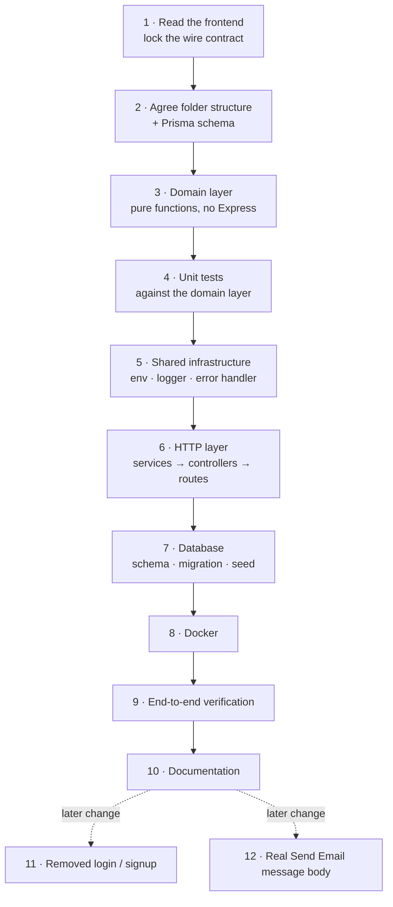
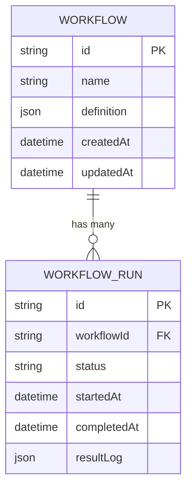
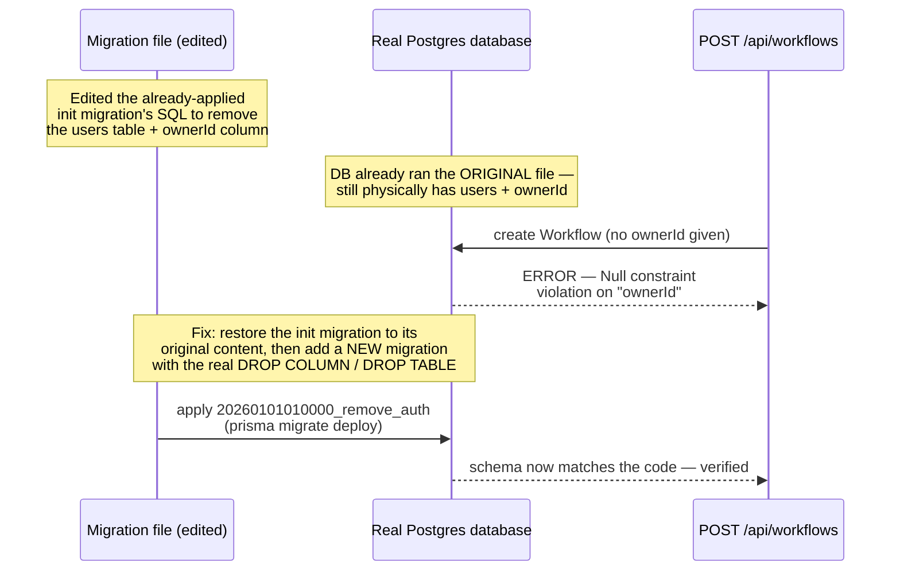
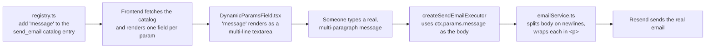

# FlowHR Backend — Build Log

How this backend was built, in the order it happened, and — since it has changed since its
first version — what changed later and why. It complements [README.md](./README.md), which
documents the finished result as it stands today; this file documents the history that
produced it.

> **If you only read one thing:** this backend has **no authentication**. Every route is
> open, and a `Workflow` is a plain global record, not owned by any particular person. That
> wasn't the original design — it was built with login/signup, then deliberately removed (see
> §12). If you see the word "auth" anywhere else — old comments, git history — it no longer
> applies to the running code.

## Contents

1. [Build order at a glance](#1-build-order-at-a-glance)
2. [Locking the contract before writing code](#2-locking-the-contract-before-writing-code)
3. [Folder structure and Prisma schema](#3-folder-structure-and-prisma-schema)
4. [The domain layer, built as pure functions](#4-the-domain-layer-built-as-pure-functions)
5. [Unit tests before routes existed](#5-unit-tests-before-routes-existed)
6. [Shared infrastructure](#6-shared-infrastructure)
7. [The HTTP layer: services, controllers, routes](#7-the-http-layer-services-controllers-routes)
8. [Database: schema, migrations, seed](#8-database-schema-migrations-seed)
9. [Docker](#9-docker)
10. [End-to-end verification](#10-end-to-end-verification)
11. [Documentation](#11-documentation)
12. [Change: removed login and signup entirely](#12-change-removed-login-and-signup-entirely)
13. [Change: a real message body for Send Email](#13-change-a-real-message-body-for-send-email)
14. [What a developer should do next](#14-what-a-developer-should-do-next)

## 1. Build order at a glance

Steps 1–10 were the original build, each depending on the one before it. Steps 11 and 12
happened afterward, against a finished, already-working backend — they're documented the
same way (what, where, why) so they're just as easy to follow.

## 2. Locking the contract before writing code

Before writing a single route, the existing FlowHR frontend (React + TypeScript + React Flow
+ Zustand, previously mocked entirely with MSW) was read to extract its *exact* wire format —
not the shape described in a spec, but what the code actually sends and expects.

| Frontend source read | What it fixed |
| --- | --- |
| `src/api/msw/handlers.ts`, `src/api/mocks/automations.ts` | The two endpoints being replaced (`GET /automations`, `POST /simulate`) and their exact response payloads |
| `src/core/types/index.ts` | Nodes are keyed by **`kind`**, not `type`; `EndNodeData` uses **`includeSummary`**, not `isSummary` — small naming details that would otherwise cause silent mismatches |
| `src/core/validation/graphValidation.ts`, `src/core/simulation/engine.ts` | The exact validation rules (single Start, reachability, cycle detection, per-node-kind required fields) and simulation traversal (BFS from Start, per-kind step messages) to mirror server-side |

> **Why this came first:** building the backend from a paraphrased spec risks a backend
> that's internally consistent but doesn't actually plug into the frontend without rework.
> Reading the real frontend code once, up front, avoided that.

## 3. Folder structure and Prisma schema

Two structural decisions were made and reviewed before any implementation:

1. **Folder structure** — domain logic (`src/domain/`) kept completely separate from HTTP
   concerns (`src/controllers/`, `src/routes/`), mirroring how the frontend keeps `core/`
   separate from its UI layer. This is what makes the graph validator and execution engine
   unit-testable without an Express server or database.
2. **Prisma schema** — originally three models (`User`, `Workflow`, `WorkflowRun`). The
   `User` model no longer exists (§12). Today `prisma/schema.prisma` has two:

The workflow graph is stored as `JSONB` (`Workflow.definition`) rather than normalized into
node/edge tables — see the README's "Architecture decisions" for the full reasoning.

Two open questions were also resolved before writing code: whether `GET /api/automations`
should return a bare array (matching the old mock exactly) or wrap it in `{ data: ... }`
(chosen, for consistency with the error envelope), and whether the wire format should use
`kind` (chosen, matches the frontend verbatim) or `type` (would have required a
frontend-side adapter).

## 4. The domain layer, built as pure functions

With the contract and schema settled, implementation started at the innermost layer —
`src/domain/` — before any Express code existed:

- **`src/domain/types.ts`** — the shared types, copied field-for-field from the frontend's
  `core/types`.
- **`src/domain/graph/validate.ts`** — re-derives every validation rule the frontend already
  checks client-side (empty graph, start/end count, orphan nodes, dead ends, reachability via
  BFS, cycle detection via DFS, per-node-kind required fields). This exists because a
  client-computed "this graph is valid" flag is not something the server can trust — a stale
  client or a crafted request could otherwise submit a broken graph.
- **`src/domain/automations/registry.ts`** — the action catalog (`send_email`,
  `generate_doc`, `create_ticket`, `slack_notify`) plus one executor per action, built so a
  real integration (`send_email` → Resend) and a simulated one (the other three, pending real
  integrations) share the same interface. Adding a fifth action means adding one catalog
  entry and, optionally, one executor function. *(Revisited later — see §13.)*
- **`src/domain/execution/engine.ts`** — walks the graph breadth-first from Start (same order
  as the old frontend mock engine), calling the matching executor for automated nodes and
  logging task/approval/end nodes as recorded (not fabricated) steps.

> **Why domain logic before routes:** these are the two pieces where a bug has real
> consequences — either a broken workflow gets allowed to run, or a run's audit trail says
> something happened that didn't. Building and testing them as plain functions (no Express,
> no Prisma) first means they could be verified correct in isolation before wiring up HTTP or
> a database at all.

## 5. Unit tests before routes existed

| Test file | Cases | Covers |
| --- | --- | --- |
| `tests/domain/validate.test.ts` | 11 | Empty graph, start/end count enforcement, unreachable vs. orphaned nodes, cycle detection, dead-end warnings, per-kind field validation |
| `tests/domain/engine.test.ts` | 5 | Linear traversal order, a failed automated step failing the whole run, the correct executor being invoked for the configured action, the empty/no-start-node edge case, a diamond-shaped graph not double-visiting a shared downstream node |

Both files were written and passing before any route existed to call them, and neither has
ever needed to touch authentication — both test the graph/engine as plain data in, plain data
out, with zero knowledge of who's calling.

## 6. Shared infrastructure

- **`src/config/env.ts`** — validates all required environment variables with Zod at process
  start; a missing or malformed required variable exits the process immediately instead of
  the app running silently misconfigured. *(It originally also required `JWT_SECRET` /
  `JWT_EXPIRES_IN` / `AUTH_RATE_LIMIT_MAX`; those are gone — see §12.)*
- **`src/lib/logger.ts`** — structured logging via pino.
- **`src/utils/apiError.ts`** + **`src/middleware/errorHandler.ts`** — a single `ApiError`
  class and one centralized Express error-handling middleware, so every error response
  (validation, not-found, unexpected) ends up in the same `{ error: { code, message } }`
  shape without each route formatting its own errors.

> **Why this before the routes that use it:** routes and controllers were written assuming
> this infrastructure already existed (`asyncHandler` wraps every async controller so a
> rejected promise reaches `errorHandler` instead of crashing the process), so it had to
> exist first.

## 7. The HTTP layer: services, controllers, routes

With domain logic tested and infrastructure in place, the HTTP-facing layers were added in
dependency order. **As originally built**, this included a full login/register system: an
`authService` (bcrypt password hashing + JWT issuing), a `requireAuth` Express middleware
checking a `Bearer` token on every workflow route, and every `Workflow` row tied to the user
who created it via an `ownerId` column. That entire layer was removed later (§12) — the table
below describes what exists **today**:

| Layer | Files | Role |
| --- | --- | --- |
| Services | `src/services/` | `workflowService` (CRUD against the `Workflow` table, no ownership check), `runService` (validates via the domain validator, executes via the domain engine, persists a `WorkflowRun`), `emailService` (the actual Resend SDK call, gated by `EMAIL_SENDING_ENABLED` — see §13 for what changed in it) |
| Validators | `src/validators/workflow.schema.ts` | Zod schema for workflow request bodies, including a discriminated union on `kind` so a malformed or mismatched node shape is rejected with a precise error instead of silently passing through |
| Controllers | `src/controllers/` | Thin: parse the request with the Zod schema, call the service, shape the response. No business logic lives here |
| Routes | `src/routes/` | Wire controllers to paths. `workflows.routes.ts` attaches a rate limiter only to `/run` — there's no login step left to rate-limit |
| App entry | `src/app.ts` / `src/index.ts` | `app.ts` assembles the Express app (helmet, CORS restricted to `CORS_ORIGIN`, JSON body parsing, the route tree, the 404 handler, the error handler) as a factory function with no `listen()` call, so it can be imported directly by tests without binding a port; `index.ts` is the one file that actually starts listening |

## 8. Database: schema, migrations, seed

`prisma/schema.prisma` originally defined three models; it now defines two (`User` was
dropped in §12). Since no local or containerized Postgres was available in the environment
this backend was first built in, the initial migration SQL was authored by hand to match
exactly what `prisma migrate dev` would generate for that original schema — a supported
Prisma pattern (a migration is just a plain `.sql` file plus a `migration_lock.toml`).

| Migration | What it does |
| --- | --- |
| `20260101000000_init` | The original schema: `users`, `workflows` (with `ownerId`), `workflow_runs` |
| `20260101010000_remove_auth` | Drops the `ownerId` column, its foreign key and index, and drops the `users` table — added later, see §12 for exactly why a *second* migration was needed instead of editing the first one |

`prisma/seed.ts` creates one sample workflow (an "Expense Reimbursement" graph, the same one
used by the frontend's importable sample) — it used to also create a demo user first, before
§12 removed the `User` model entirely.

## 9. Docker

A single-stage `Dockerfile` (install deps → `prisma generate` → `tsc` build → run
`prisma migrate deploy` at container start, then start the server) was chosen over a
multi-stage build for this v1's scope — simplicity over image-size optimization, called out
in the README as a possible future improvement rather than built preemptively.
`docker-compose.yml` adds a local Postgres container with a health check the API container
waits on, for a one-command local dev loop (`docker compose up --build`).

## 10. End-to-end verification

With no live Postgres available in the original build environment, verification was scoped
to what's actually testable without one:

- [x] `npx tsc --noEmit` — zero type errors across the whole `src/` tree
- [x] `npm test` (vitest) — all 16 domain tests passing
- [x] `npm run build` — production build succeeds
- [x] Compiled server smoke-tested directly: `GET /health` → `{"status":"ok"}`,
      `GET /api/automations` → the wrapped catalog in the shape the frontend expects

Routes that needed a real database were only checked to fail *safely* (a generic
`INTERNAL_ERROR`, never a stack trace or crash) without one. Every later change (§12, §13)
was re-verified the same way — `tsc --noEmit` and `npm test` passing — plus, once a real
local Postgres was available, an actual `POST /api/workflows` → `POST /api/workflows/:id/run`
request cycle exercised directly against the running server.

## 11. Documentation

[README.md](./README.md) covers the finished state: how to run locally and via Docker, every
environment variable, the API surface, and — per the original brief's explicit ask — the
reasoning behind the two "tricky calls": JSONB vs. normalized graph storage, and how real
execution is split from simulated/logged steps for node kinds that can't genuinely run
without a human. This file covers the process that produced that state, including the two
changes below, for a developer who wants the "why this order" and "why it changed" as well as
the "what."

## 12. Change: removed login and signup entirely

The backend was originally built with full authentication (JWT-based login/register, bcrypt
password hashing, every workflow route requiring a `Bearer` token, every `Workflow` row owned
by a `User`). This was a deliberate product decision to remove: FlowHR is meant to be used
without an account wall, so login, signup, and the whole concept of "whose workflow is this"
were taken out — not hidden behind a flag, actually deleted.

**What was deleted, and where:**

| Layer | What's gone |
| --- | --- |
| Frontend | `src/app/AuthGate.tsx` (the login/register screen that wrapped the whole app) and `src/api/authStore.ts` (the token store) deleted outright. `App.tsx` no longer wraps the app in `<AuthGate>`. `Toolbar.tsx` no longer shows a "sign out" button. `client.ts` no longer attaches an `Authorization: Bearer <token>` header or reacts to `401`s by logging out |
| Backend | `src/controllers/auth.controller.ts`, `src/routes/auth.routes.ts`, `src/services/authService.ts`, `src/validators/auth.schema.ts`, `src/middleware/auth.ts` (the `requireAuth` middleware) all deleted. `workflows.routes.ts` no longer calls `requireAuth`. `rateLimiter.ts` lost its `authRateLimiter` (no login endpoint left to protect from brute-forcing). `env.ts` no longer requires `JWT_SECRET` / `JWT_EXPIRES_IN` / `AUTH_RATE_LIMIT_MAX`. `jsonwebtoken` and `bcryptjs` (and their `@types` packages) removed from `package.json` |
| Database | `User` model deleted from `schema.prisma`; the `ownerId` column, its foreign key, and its index deleted from `Workflow`. `workflowService.ts` / `workflows.controller.ts` no longer take or check an owner/user id anywhere — `listWorkflows()`, `getWorkflow()`, etc. now operate on all workflows, not "the caller's" |

**A real gotcha worth understanding if you're new to Prisma migrations:**

Editing a migration file after it has already been applied doesn't retroactively change a
real database — it just makes the code and the database disagree. The fix was to put the
original `20260101000000_init` file back exactly as it was (so it still matches what the
database recorded as "already applied"), then add a brand-new migration,
`20260101010000_remove_auth`, with the actual `ALTER TABLE ... DROP COLUMN` / `DROP TABLE`
statements needed, applied with `npx prisma migrate deploy`.

> **Rule of thumb:** once a migration file has run against any real database, treat it as
> permanent history. Changes always go in a *new* migration file — never by editing an old
> one.

`README.md` was also updated throughout to remove every mention of auth (the environment
variable table, the API surface table's now-nonexistent "Auth" column, the setup
instructions, the "what's stubbed" list) and to state plainly that every route is open.

## 13. Change: a real message body for Send Email

Originally, an `automated` node configured with the `send_email` action could only set a `to`
address and a `subject` — the actual email body was always a fixed, generic sentence
(`Automated notification from workflow step "<node title>".`), regardless of what the
workflow was actually for. A workflow like a leave-approval process couldn't send an email
that actually said anything about the leave that was approved.

**What changed, and where:**

- **`src/domain/automations/registry.ts`** — the `send_email` entry in `AUTOMATION_CATALOG`
  gained a third parameter, `message`, alongside `to` and `subject`. This matters more than
  it looks: the frontend builds its "configure this automation" form entirely from this
  catalog, so without adding `'message'` here, there would be no way to type a message into
  the app at all. `createSendEmailExecutor` now uses `ctx.params.message` as the email body
  when provided, falling back to the old generic sentence only if it's left blank.
- **`src/services/emailService.ts`** — the call to Resend now sends an `html` version of the
  email alongside the plain-text one, built by splitting the body on newlines and wrapping
  each line in a `
` tag. A multi-paragraph message (like a leave-notification template
  with blank lines between sections) needs real HTML `
` tags to keep those line breaks
  when an email client renders it — plain text alone can lose that formatting.
- **Frontend, `src/features/inspector/fields/DynamicParamsField.tsx`** — the panel where
  someone configures an automation's parameters renders one input box per parameter name in
  the catalog. Every parameter used to get the same single-line text box, but a single-line
  box can't contain line breaks at all — there'd be no way to type a multi-paragraph message
  even after the two backend changes above. The `message` parameter specifically now renders
  as a resizable, multi-line `<textarea>`, while `to` and `subject` stay single-line.

**How to use it:** on an `automated` node, choose the "Send Email" action, then fill in `to`,
`subject`, and — in the new multi-line box — whatever message text the email should actually
contain, including blank lines between paragraphs. Running the workflow (with
`EMAIL_SENDING_ENABLED=true` and a real `RESEND_API_KEY` set — see README "Environment
variables") sends that exact text as the email.

## 14. What a developer should do next

- [ ] Get a free Postgres instance (Neon/Supabase/Render) and point `DATABASE_URL` at it, or
      run `docker compose up --build` locally.
- [ ] Run `npm run db:migrate:dev` (or `db:migrate` in production) against that database — it
      applies both migrations in order (`20260101000000_init`, then
      `20260101010000_remove_auth`), ending up at today's schema (`Workflow`, `WorkflowRun`,
      no `User`).
- [ ] Run `npm run db:seed`, then exercise `POST /api/workflows` → `POST /api/workflows/:id/run`
      — no login step needed, every route is open.
- [ ] To make "Send Email" send real emails instead of being logged as simulated, follow
      README "Environment variables" to set `RESEND_API_KEY`, `EMAIL_FROM`, and
      `EMAIL_SENDING_ENABLED=true`.
- [ ] Wire up the frontend per the README's "Frontend integration notes" (base URL, unwrapping
      `{ data }`) — no `Authorization` header needed anywhere.
